# Go WARC Library - Architecture Overview

This document provides a comprehensive overview of the gowarc library architecture and component interactions.

## High-Level Component Architecture

```mermaid
graph TB
    subgraph "User Application"
        APP[Application Code]
    end

    subgraph "HTTP Client Layer"
        CLIENT[CustomHTTPClient<br/>- http.Client wrapper<br/>- Dedup hash table<br/>- WARC writer channel<br/>- Stats/Logging]
        TRANSPORT[customTransport<br/>- Force gzip header<br/>- Decompress responses]
        DIALER[customDialer<br/>- Proxy selection<br/>- DNS resolution<br/>- Connection wrapping]
    end

    subgraph "Network Layer"
        DNS[DNS Resolver<br/>- Concurrent lookup<br/>- TTL cache<br/>- WARC recording]
        PROXY[Proxy Selection<br/>- Type filtering<br/>- Network filtering<br/>- Domain filtering<br/>- Round-robin LB]
        CONN[CustomConnection<br/>- Bidirectional capture<br/>- TeeReader/MultiWriter<br/>- Read deadline]
    end

    subgraph "Capture Layer"
        PIPES[IO Pipes<br/>- Request pipe<br/>- Response pipe]
        PARSE[HTTP Parser<br/>- Request/Response<br/>- Extract metadata<br/>- Calculate digests]
        DEDUPE[Deduplication<br/>- Local hash table<br/>- Doppelganger API<br/>- CDX API]
    end

    subgraph "WARC Writing Pipeline"
        BATCH[RecordBatch Channel<br/>- Buffered channel<br/>- Multiple writers]
        WRITER[recordWriter Goroutines<br/>- Pool of writers<br/>- File rotation<br/>- Compression]
        DISK[WARC Files<br/>- .warc.gz/.warc.zst<br/>- Auto-rotation<br/>- Sequential naming]
    end

    subgraph "Supporting Systems"
        STATS[Stats Registry<br/>- Counters<br/>- Gauges<br/>- Histograms]
        LOG[Log Backend<br/>- slog interface<br/>- Debug/Info/Warn/Error]
        TEMP[Temp File System<br/>- SpooledTempFile<br/>- RAM → Disk threshold]
    end

    APP --> CLIENT
    CLIENT --> TRANSPORT
    TRANSPORT --> DIALER

    DIALER --> DNS
    DIALER --> PROXY
    DIALER --> CONN

    CONN --> PIPES
    PIPES --> PARSE
    PARSE --> DEDUPE

    DEDUPE --> BATCH
    BATCH --> WRITER
    WRITER --> DISK

    CLIENT -.-> STATS
    CLIENT -.-> LOG
    DIALER -.-> STATS
    DIALER -.-> LOG
    PARSE -.-> TEMP
    WRITER -.-> STATS
    WRITER -.-> LOG

    style CLIENT fill:#e1f5ff
    style DIALER fill:#fff4e1
    style CONN fill:#ffe1e1
    style BATCH fill:#e1ffe1
    style WRITER fill:#f0e1ff
```

## Core Data Structures

## Component Responsibilities

### CustomHTTPClient
- **Purpose**: Main entry point for making HTTP requests with WARC recording
- **Key Features**:
  - Extends standard `http.Client`
  - Manages deduplication hash table
  - Coordinates WARC writer goroutines
  - Tracks active requests with WaitGroup
  - Integrates stats and logging

### customDialer
- **Purpose**: Establishes network connections with proxy support and DNS resolution
- **Key Features**:
  - Proxy selection and filtering (type, network, domain)
  - Concurrent DNS resolution with caching
  - Connection wrapping for byte capture
  - TLS handshake with custom fingerprinting
  - Load balancing across proxies

### CustomConnection
- **Purpose**: Transparent connection wrapper that captures all traffic
- **Key Features**:
  - Bidirectional byte capture using io.Pipe
  - TeeReader for response interception
  - MultiWriter for request interception
  - Configurable read deadlines
  - Automatic goroutine launch for WARC creation

### RecordBatch & Record
- **Purpose**: Represent HTTP request/response pairs for archival
- **Key Features**:
  - Groups related records (request + response)
  - Shared capture timestamp
  - Optional feedback channel for synchronous writes
  - SpooledTempFile content for memory efficiency

### Writer & RotatorSettings
- **Purpose**: Write WARC records to compressed files with rotation
- **Key Features**:
  - Multi-threaded writer pool
  - Automatic file rotation based on size
  - GZIP/ZSTD compression support
  - Dictionary compression for ZSTD
  - Sequential file naming with collision avoidance

## Threading Model

## Configuration Flow

## Metrics Collection Points

## Logging Events

The library emits structured logs at various levels:

### Debug Level
- Proxy selection decisions
- DNS resolution results
- Connection establishment details
- TLS handshake success

### Info Level
- WARC file creation
- WARC file rotation
- WARC writer shutdown

### Error Level
- DNS resolution failures
- Proxy connection failures
- Direct connection failures
- TLS handshake failures
- WARC record writing errors
- Digest calculation errors
- HTTP parsing errors
- DiscardHook rejections

All log events include contextual key-value pairs for filtering and debugging.
