# Component Interactions and Subsystems

This document breaks down the gowarc library into logical subsystems and shows how they interact with each other.

## Subsystem Architecture

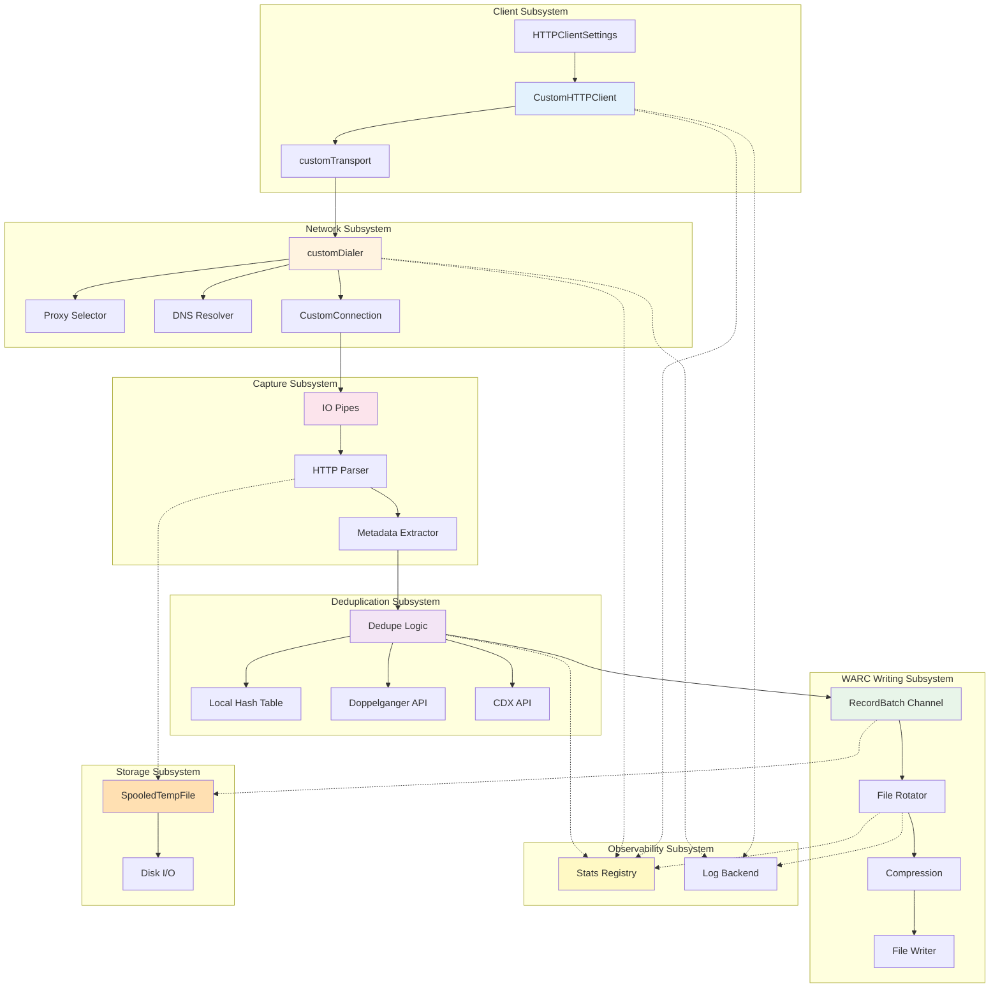

## Subsystem Details

### 1. Client Subsystem

**Purpose:** Entry point and coordination of all other subsystems

**Components:**
- `CustomHTTPClient` - Main client that extends `http.Client`
- `HTTPClientSettings` - Configuration structure
- `customTransport` - Custom HTTP transport layer

**Key Interactions:**

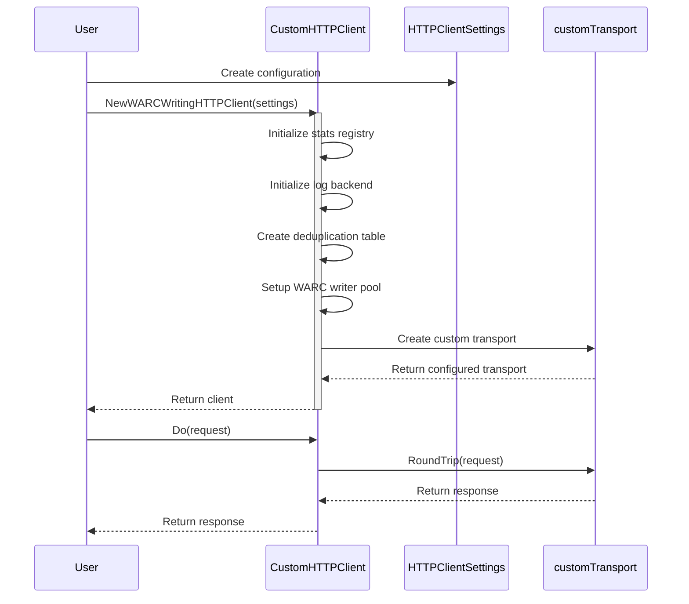

**Responsibilities:**
- Initialize all subsystems
- Manage deduplication hash table
- Coordinate WARC writer goroutines
- Track active requests via WaitGroup
- Provide public API surface

### 2. Network Subsystem

**Purpose:** Establish network connections with proxy and DNS support

**Components:**
- `customDialer` - Connection establishment logic
- Proxy selection algorithm
- DNS resolution with caching
- `CustomConnection` - Wrapped connection

**Proxy Selection Logic:**

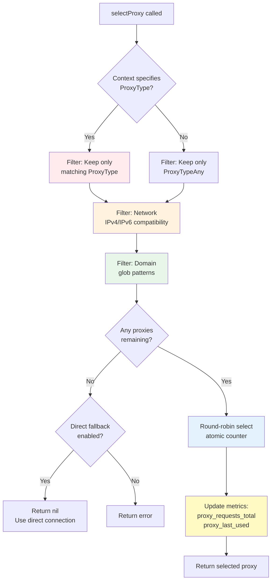

**DNS Resolution Flow:**

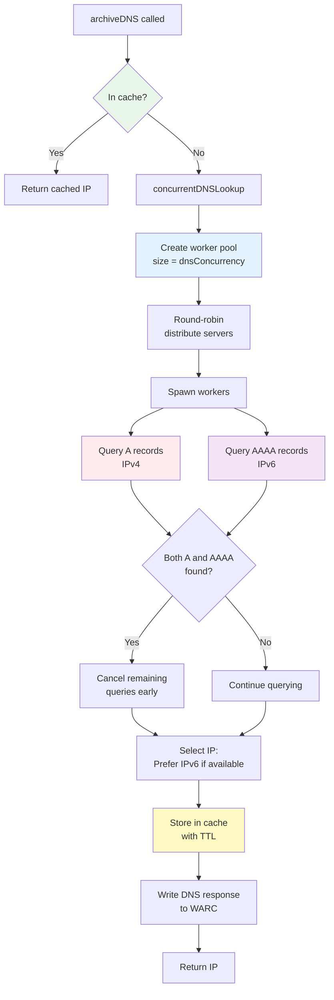

**Connection Wrapping:**

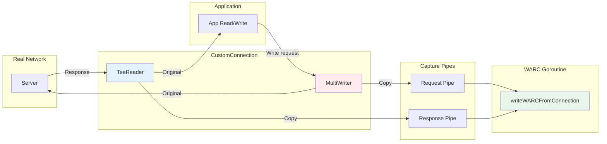

### 3. Capture Subsystem

**Purpose:** Parse and extract metadata from HTTP traffic

**Components:**
- IO pipes for request/response capture
- HTTP request/response parsers
- Metadata extraction (URI, headers, timing)

**Request/Response Processing:**

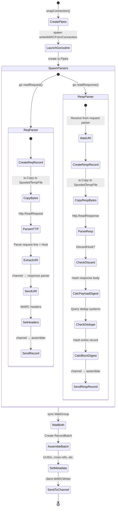

**Metadata Extraction Points:**

| Metadata | Source | Location |
|----------|--------|----------|
| WARC-Target-URI | HTTP request line + Host header | client.go:679 |
| WARC-Date | Capture timestamp | warc.go:165 |
| WARC-Record-ID | UUID generation | client.go:735 |
| WARC-Concurrent-To | Cross-reference to paired record | client.go:740 |
| WARC-IP-Address | conn.RemoteAddr() | dialer.go:765 |
| WARC-Payload-Digest | Hash of response body | client.go:693 |
| WARC-Block-Digest | Hash of entire record | client.go:720 |
| Content-Type | HTTP response header | client.go:656 |
| Content-Length | Record content size | warc.go:169 |

### 4. Deduplication Subsystem

**Purpose:** Avoid storing duplicate content

**Components:**
- Local hash table (`sync.Map`)
- Doppelganger API client
- CDX API client

**Deduplication Decision Tree:**

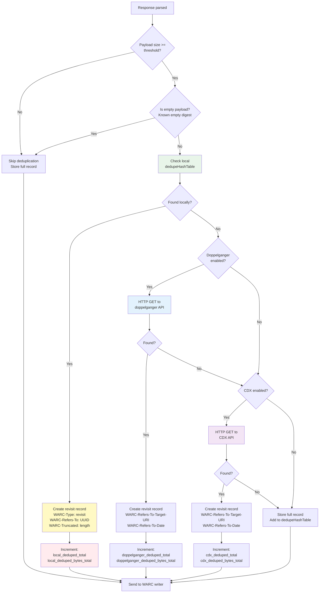

**Revisit Record Structure:**

```
Normal Response Record:
WARC-Type: response
WARC-Record-ID: <urn:uuid:NEW-UUID>
WARC-Target-URI: https://example.com/page
WARC-Payload-Digest: sha1:ABC123...
Content-Length: 50000
[Full HTTP response with body]

↓ Becomes (if duplicate found) ↓

Revisit Record:
WARC-Type: revisit
WARC-Record-ID: <urn:uuid:NEW-UUID>
WARC-Target-URI: https://example.com/page
WARC-Refers-To-Target-URI: https://example.com/page
WARC-Refers-To-Date: 2025-01-20T10:30:00Z
WARC-Refers-To: <urn:uuid:ORIGINAL-UUID>  (if local)
WARC-Payload-Digest: sha1:ABC123...
WARC-Truncated: length
WARC-Profile: http://netpreserve.org/warc/1.1/revisit/identical-payload-digest
Content-Length: 250
[HTTP response headers only, body truncated]
```

### 5. WARC Writing Subsystem

**Purpose:** Persist records to disk with compression and rotation

**Components:**
- RecordBatch channel (buffered)
- Pool of recordWriter goroutines
- File rotation logic
- Compression (GZIP/ZSTD)

**Writer Pool Architecture:**

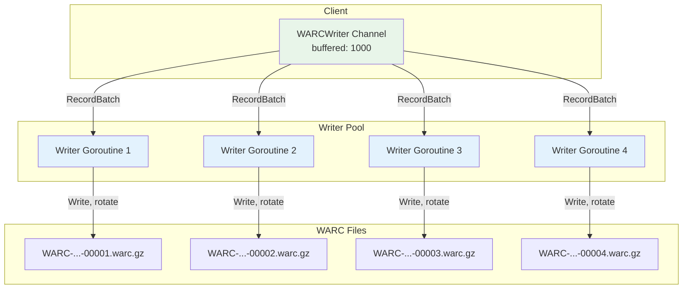

**File Rotation State Machine:**

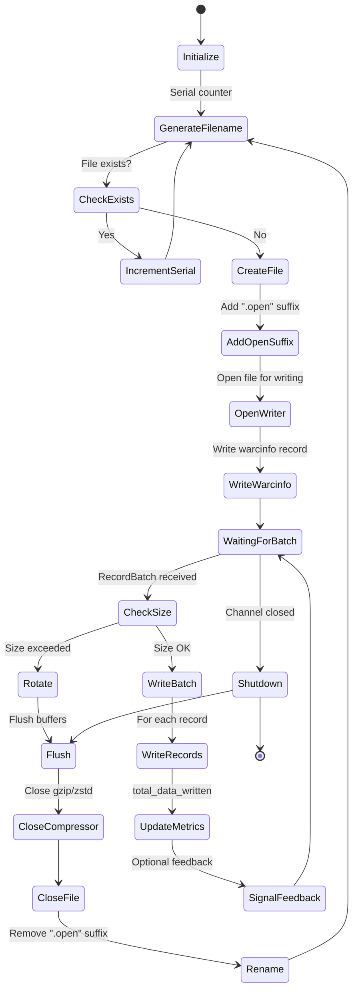

**Compression Pipeline:**

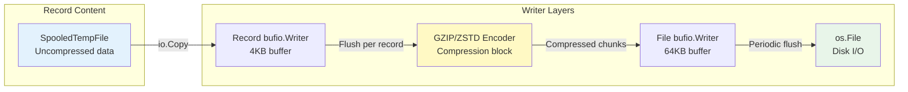

### 6. Observability Subsystem

**Purpose:** Provide metrics and logging for monitoring and debugging

**Components:**
- StatsRegistry interface (Counters, Gauges, Histograms)
- LogBackend interface (Debug, Info, Warn, Error)

**Metrics Collection Points:**

```mermaid
graph TB
    subgraph "Data Path Metrics"
        M1[total_data_written<br/>Type: Counter<br/>Location: Writer]
    end

    subgraph "Deduplication Metrics"
        M2[local_deduped_total<br/>Type: Counter<br/>Location: Dedupe]
        M3[local_deduped_bytes_total<br/>Type: Counter<br/>Location: Dedupe]
        M4[doppelganger_deduped_total<br/>Type: Counter<br/>Location: Dedupe]
        M5[doppelganger_deduped_bytes_total<br/>Type: Counter<br/>Location: Dedupe]
        M6[cdx_deduped_total<br/>Type: Counter<br/>Location: Dedupe]
        M7[cdx_deduped_bytes_total<br/>Type: Counter<br/>Location: Dedupe]
    end

    subgraph "Proxy Metrics"
        M8[proxy_requests_total<br/>Type: Counter<br/>Labels: proxy<br/>Location: Dialer]
        M9[proxy_errors_total<br/>Type: Counter<br/>Labels: proxy<br/>Location: Dialer]
        M10[proxy_last_used_nanoseconds<br/>Type: Gauge<br/>Labels: proxy<br/>Location: Dialer]
    end

    subgraph "StatsRegistry Implementation"
        IMPL[User-provided or<br/>Local Registry]
    end

    M1 --> IMPL
    M2 --> IMPL
    M3 --> IMPL
    M4 --> IMPL
    M5 --> IMPL
    M6 --> IMPL
    M7 --> IMPL
    M8 --> IMPL
    M9 --> IMPL
    M10 --> IMPL

    style M1 fill:#e3f2fd
    style M2 fill:#fff9c4
    style M8 fill:#ffebee
    style IMPL fill:#e8f5e9
```

**Logging Event Hierarchy:**

```mermaid
graph TB
    subgraph "Debug Events"
        D1[Proxy selected<br/>dialer.go:293]
        D2[DNS resolved<br/>dns.go:44]
        D3[Connection established<br/>dialer.go:473]
        D4[TLS connection established<br/>dialer.go:594]
        D5[WARC record written<br/>write.go:145]
    end

    subgraph "Info Events"
        I1[WARC file created<br/>warc.go:132]
        I2[WARC file rotation<br/>warc.go:152]
        I3[WARC writer shutdown<br/>warc.go:224]
    end

    subgraph "Error Events"
        E1[DNS resolution failed<br/>dns.go:52]
        E2[Proxy connection failed<br/>dialer.go:456]
        E3[Direct connection failed<br/>dialer.go:483]
        E4[TLS handshake failed<br/>dialer.go:575]
        E5[WARC record write failed<br/>write.go:139]
        E6[DiscardHook rejection<br/>client.go:671]
        E7[Digest calculation failed<br/>client.go:705]
    end

    subgraph "LogBackend"
        LOG[User-provided or<br/>No-op Logger]
    end

    D1 --> LOG
    D2 --> LOG
    D3 --> LOG
    D4 --> LOG
    D5 --> LOG
    I1 --> LOG
    I2 --> LOG
    I3 --> LOG
    E1 --> LOG
    E2 --> LOG
    E3 --> LOG
    E4 --> LOG
    E5 --> LOG
    E6 --> LOG
    E7 --> LOG

    style D1 fill:#e3f2fd
    style I1 fill:#e8f5e9
    style E1 fill:#ffebee
    style LOG fill:#fff9c4
```

### 7. Storage Subsystem

**Purpose:** Efficient temporary storage with RAM/disk threshold

**Component:**
- `SpooledTempFile` - Automatic RAM → disk spillover

**SpooledTempFile State Machine:**

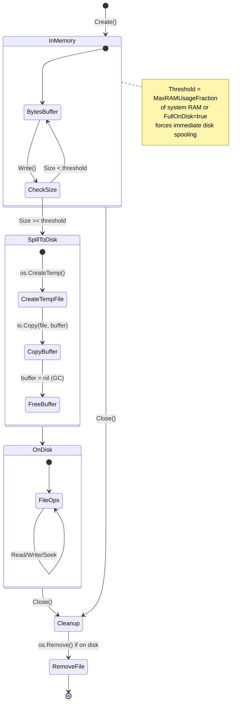

**Memory Pressure Management:**

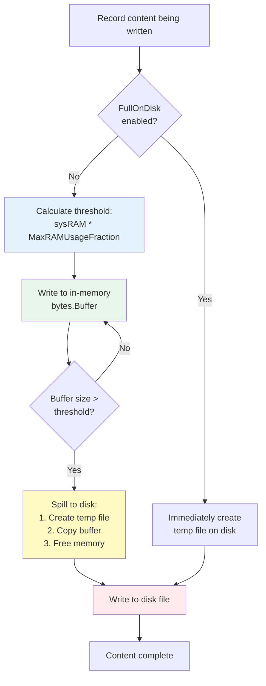

## Inter-Subsystem Communication

### Message Passing

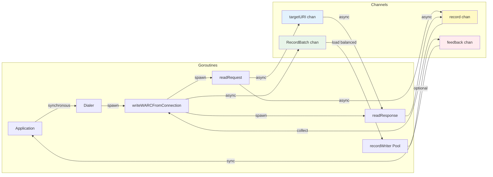

### Synchronization Primitives

| Primitive | Usage | Location |
|-----------|-------|----------|
| `sync.WaitGroup` | Wait for all active requests | CustomHTTPClient.WaitGroup |
| `sync.Map` | Thread-safe deduplication table | CustomHTTPClient.dedupeHashTable |
| `atomic.Uint32` | Lock-free proxy round-robin | customDialer.proxyRoundRobinIndex |
| `sync.Once` | One-time read deadline set | CustomConnection.firstRead |
| `sync.Mutex` | Protect testLogger entries | testLogger.mu |
| Buffered channels | Async batch submission | WARCWriter (buffer: 1000) |
| Unbuffered channels | Sync metadata passing | targetURICh, recordChan |
| Optional feedback chan | Synchronous WARC write | RecordBatch.FeedbackChan |

### Context Propagation

```mermaid
graph TD
    START[Application creates context]

    START --> CTX1[context.Background]

    CTX1 --> ADD_TIMEOUT[Add timeout:<br/>ctx, cancel = context.WithTimeout]

    ADD_TIMEOUT --> ADD_PROXY[Add proxy type:<br/>warc.WithProxyType]

    ADD_PROXY --> ADD_FEEDBACK[Add feedback channel:<br/>warc.WithFeedbackChannel]

    ADD_FEEDBACK --> ADD_CONN[Add connection channel:<br/>warc.WithWrappedConnection]

    ADD_CONN --> USE_CTX[req = req.WithContext(ctx)]

    USE_CTX --> PROP1[client.Do<br/>→ transport.RoundTrip]

    PROP1 --> PROP2[→ dialer.CustomDialContext]

    PROP2 --> PROP3[→ wrapConnection]

    PROP3 --> PROP4[→ writeWARCFromConnection]

    PROP4 --> EXTRACT[Extract context values:<br/>- ProxyType<br/>- FeedbackChan<br/>- ConnChan]

    EXTRACT --> USE[Use values to control:<br/>- Proxy selection<br/>- Synchronous writes<br/>- Connection inspection]

    style ADD_TIMEOUT fill:#ffebee
    style ADD_PROXY fill:#e3f2fd
    style ADD_FEEDBACK fill:#e8f5e9
    style EXTRACT fill:#fff9c4
```

## Advanced Features

### 1. Synchronous WARC Writes

**Default (Async):**
```go
resp, _ := client.Do(req)
io.Copy(io.Discard, resp.Body)
resp.Body.Close()
// WARC writing happens in background
// Returns immediately
```

**Synchronous:**
```go
feedbackChan := make(chan struct{})
ctx := warc.WithFeedbackChannel(context.Background(), feedbackChan)
req = req.WithContext(ctx)

resp, _ := client.Do(req)
io.Copy(io.Discard, resp.Body)
resp.Body.Close()

<-feedbackChan  // Blocks until WARC written to disk
```

### 2. Connection Inspection

```go
connChan := make(chan *warc.CustomConnection, 1)
ctx := warc.WithWrappedConnection(context.Background(), connChan)
req = req.WithContext(ctx)

resp, _ := client.Do(req)

// Access wrapped connection
wrappedConn := <-connChan
realConn := wrappedConn.Conn  // Underlying net.Conn
// Can inspect TLS state, remote address, etc.
```

### 3. Random Local IP (IPv6)

**Purpose:** Avoid rate limiting by varying source IP

```go
client, _ := warc.NewWARCWritingHTTPClient(warc.HTTPClientSettings{
    RandomLocalIP: true,
    IPv6AnyIP:     true,  // Use ::/64 prefix from available interfaces
})
```

**How it works:**
1. Goroutine watches network interfaces (polls every 10s)
2. Detects IPv6 addresses with /64 prefix
3. For each request:
   - Generates random IPv6 in detected subnets
   - Sets as `LocalAddr` on dialer
   - Each request uses different source IP

### 4. Custom TLS Fingerprinting

Uses `refraction-networking/utls` to mimic real browsers:

```go
func getCustomTLSSpec() utls.ClientHelloID {
    return utls.HelloChrome_120  // Looks like Chrome 120
}
```

Avoids TLS-based blocking/fingerprinting.

## Error Handling Patterns

### Network Errors

```go
// Proxy connection failed
if err != nil {
    logBackend.Error("proxy connection failed",
        "proxy", selectedProxy.name,
        "address", address,
        "error", err)
    statsRegistry.Counter("proxy_errors_total",
        label.String("proxy", selectedProxy.name)).Inc()

    // Try direct connection if allowed
    if allowDirectFallback {
        return directConnection()
    }
    return nil, err
}
```

### WARC Writing Errors

```go
if err := writer.WriteRecord(record); err != nil {
    logBackend.Error("failed to write WARC record content",
        "file", writer.FileName,
        "error", err)
    // Continue to next record (don't crash)
}
```

### Graceful Degradation

- DNS failure → Return error (don't archive)
- Proxy failure → Try direct (if allowed)
- Dedupe API failure → Store full record
- Digest calculation error → Log and skip digest
- DiscardHook error → Log and keep record

## Performance Optimizations

### 1. Concurrent DNS Queries

```go
// Sequential (dnsConcurrency = 1)
for _, server := range dnsServers {
    result, err := query(server)
    if err == nil { return result }
}

// Parallel (dnsConcurrency = -1)
results := make(chan result, len(dnsServers))
for _, server := range dnsServers {
    go func(s string) {
        results <- query(s)
    }(server)
}
// Early termination when both A and AAAA found
```

### 2. Writer Pool Parallelism

```go
// Single writer (WARCWriterPoolSize = 1)
// Bottleneck: One file open at a time

// Multiple writers (WARCWriterPoolSize = 4)
// Each writer has its own file
// 4x throughput (if not I/O bound)
```

### 3. Buffered Channels

```go
// Unbuffered (bad)
WARCWriter = make(chan *RecordBatch)
// Producer blocks until consumer ready

// Buffered (good)
WARCWriter = make(chan *RecordBatch, 1000)
// Producer continues until buffer full
// Smooths burst traffic
```

### 4. Atomic Operations

```go
// Lock-based (slower)
mu.Lock()
index = (index + 1) % len(proxies)
mu.Unlock()

// Atomic (faster)
index := d.proxyRoundRobinIndex.Add(1) % uint32(len(proxies))
```

## Summary

The gowarc library is built on several key architectural principles:

1. **Separation of Concerns**: Each subsystem has a clear responsibility
2. **Concurrent Design**: Goroutines + channels for parallelism
3. **Pluggable Interfaces**: Stats, logging, deduplication can be customized
4. **Resource Efficiency**: Spooled temp files, connection pooling, caching
5. **Observability**: Comprehensive metrics and structured logging
6. **Fault Tolerance**: Graceful error handling, fallback mechanisms
7. **Performance**: Parallel DNS, writer pools, atomic operations

Any software engineer reviewing these diagrams should understand:
- How requests flow from application to WARC file
- Where proxies and DNS resolution fit in
- How byte capture works (pipes + goroutines)
- When and how deduplication occurs
- The role of each subsystem
- How to customize behavior via interfaces
