# Request Flow: HTTPS via IPv6 Residential Proxy → WARC File

This document traces the complete journey of an HTTPS request through an IPv6 residential proxy, showing every step from the initial request to the final WARC file on disk.

## Complete Flow Diagram

```mermaid
sequenceDiagram
    autonumber
    participant App as Application
    participant Client as CustomHTTPClient
    participant Transport as customTransport
    participant Dialer as customDialer
    participant DNS as DNS Resolver
    participant Proxy as Proxy Selector
    participant ProxyConn as Proxy Connection
    participant Wrapper as wrapConnection
    participant ReqPipe as Request Pipe
    participant RespPipe as Response Pipe
    participant ReqParser as readRequest Goroutine
    participant RespParser as readResponse Goroutine
    participant Dedupe as Deduplication
    participant Batch as RecordBatch Channel
    participant Writer as recordWriter
    participant Disk as WARC File

    %% Request initiation
    App->>Client: client.Do(req)<br/>GET https://example.com/page
    Client->>Transport: RoundTrip(req)
    Transport->>Transport: Add "Accept-Encoding: gzip"
    Transport->>Dialer: CustomDialTLSContext(ctx, "tcp", "example.com:443")

    %% Network type selection
    Dialer->>Dialer: getNetworkType("tcp")<br/>→ "tcp6" (IPv6 enabled, IPv4 disabled)

    %% Proxy selection
    Dialer->>Proxy: selectProxy(ctx, "tcp6", "example.com:443")
    Proxy->>Proxy: Filter by ProxyType<br/>(ctx requests Residential → use only Residential)
    Proxy->>Proxy: Filter by Network<br/>(tcp6 → skip IPv4-only proxies)
    Proxy->>Proxy: Filter by AllowedDomains<br/>(check if "example.com" matches globs)
    Proxy->>Proxy: Round-robin select<br/>proxyDialers[index++ % len]
    Proxy-->>Dialer: Selected: "socks5://proxy.residential.net:1080"<br/>Type=Residential, Network=Any
    Dialer->>Dialer: statsRegistry.Counter("proxy_requests_total",<br/>label="proxy.residential.net:1080").Inc()
    Dialer->>Dialer: logBackend.Debug("proxy selected",<br/>"proxy", "proxy.residential.net:1080")

    %% DNS resolution (skipped for socks5h)
    Note over Dialer,DNS: Proxy scheme is socks5h → remote DNS
    Dialer->>Dialer: Skip local DNS (let proxy resolve)

    %% Establish connection via proxy
    Dialer->>ProxyConn: proxyDialer.DialContext(ctx, "tcp6", "example.com:443")
    ProxyConn-->>Dialer: Plain TCP connection to proxy
    Dialer->>Dialer: logBackend.Debug("connection established via proxy")

    %% TLS handshake
    Dialer->>Dialer: tlsConn = utls.UClient(conn, tlsConfig)<br/>ServerName="example.com"<br/>InsecureSkipVerify=false
    Dialer->>Dialer: tlsConn.ApplyPreset(Chrome120)
    Dialer->>ProxyConn: tlsConn.HandshakeContext(ctx, 10s timeout)
    ProxyConn-->>Dialer: TLS handshake complete
    Dialer->>Dialer: logBackend.Debug("TLS connection established via proxy")

    %% Wrap connection for capture
    Dialer->>Wrapper: wrapConnection(ctx, tlsConn, "https")
    Wrapper->>ReqPipe: reqReader, reqWriter = io.Pipe()
    Wrapper->>RespPipe: respReader, respWriter = io.Pipe()

    %% Launch WARC recording goroutine
    Wrapper->>ReqParser: go writeWARCFromConnection(...)
    activate ReqParser
    Wrapper->>Wrapper: Create CustomConnection:<br/>Reader = io.TeeReader(tlsConn, respWriter)<br/>Writer = io.MultiWriter(reqWriter, tlsConn)
    Wrapper-->>Dialer: Return CustomConnection
    Dialer-->>Transport: Return connection
    Transport-->>Client: Return connection

    %% Application makes request
    Client-->>App: Return &http.Response{Body: ...}
    App->>App: Send HTTP request<br/>(written to CustomConnection.Writer)
    Note over App,ReqPipe: Request bytes flow through MultiWriter<br/>to both real connection AND reqWriter pipe

    %% Parse request in background
    ReqParser->>ReqParser: go readRequest(reqReader)
    activate RespParser
    ReqParser->>ReqParser: Create request Record
    ReqParser->>ReqParser: Copy bytes from reqReader to Record.Content<br/>(SpooledTempFile)
    ReqParser->>ReqParser: Parse HTTP request line:<br/>GET /page HTTP/1.1
    ReqParser->>ReqParser: Extract Host header: example.com
    ReqParser->>ReqParser: Construct WARC-Target-URI:<br/>https://example.com/page
    ReqParser->>RespParser: Send targetURI via channel

    %% Application reads response
    App->>App: io.Copy(dst, resp.Body)
    Note over App,RespPipe: Response bytes flow through TeeReader<br/>from real connection to both app AND respWriter pipe

    %% Parse response in background
    RespParser->>RespParser: Receive targetURI from channel
    RespParser->>RespParser: Create response Record
    RespParser->>RespParser: Copy bytes from respReader to Record.Content<br/>(SpooledTempFile)
    RespParser->>RespParser: Seek to start of Record.Content
    RespParser->>RespParser: http.ReadResponse(bufio.Reader(Content))
    RespParser->>RespParser: Check DiscardHook(response)<br/>→ (false, "") → Keep record

    %% Calculate payload digest
    RespParser->>RespParser: Seek to payload start (skip HTTP headers)
    RespParser->>RespParser: Calculate SHA1 digest of body
    RespParser->>RespParser: payloadDigest = "sha1:ABC123..."
    RespParser->>RespParser: Set WARC-Payload-Digest header

    %% Deduplication check
    RespParser->>Dedupe: Check if payloadDigest in dedupeHashTable
    Dedupe-->>RespParser: Not found (first time seeing this)
    Note over RespParser,Dedupe: If found, would create revisit record here

    %% Complete record processing
    RespParser->>RespParser: Seek back to start
    RespParser->>RespParser: Calculate block digest (entire record)
    RespParser-->>ReqParser: Send response record via channel
    deactivate RespParser

    %% Finalize batch
    ReqParser->>ReqParser: Wait for both goroutines
    ReqParser->>ReqParser: Create RecordBatch:<br/>- Records: [request, response]<br/>- CaptureTime: RFC3339Nano timestamp
    ReqParser->>ReqParser: Set WARC-Record-ID (UUID) on each
    ReqParser->>ReqParser: Set WARC-Concurrent-To (cross-reference)
    ReqParser->>ReqParser: Set WARC-Target-URI on both
    ReqParser->>ReqParser: Set WARC-IP-Address: <not set, proxied>
    ReqParser->>ReqParser: Store in dedupeHashTable:<br/>Key=payloadDigest<br/>Value=(UUID, targetURI, date, size)
    ReqParser->>Batch: Send RecordBatch to client.WARCWriter channel
    deactivate ReqParser

    %% WARC writing
    Batch->>Writer: RecordBatch received by recordWriter goroutine
    activate Writer
    Writer->>Writer: Check current file size vs WARCSize limit
    Note over Writer: If exceeded: rotate to new file
    Writer->>Writer: For each record in batch:
    Writer->>Writer: Set WARC-Date from batch.CaptureTime
    Writer->>Writer: Set WARC-Warcinfo-ID (reference to warcinfo)
    Writer->>Writer: Set Content-Length (from record.Content size)
    Writer->>Writer: WriteRecord(record):<br/>1. Write "WARC/1.1\r\n"<br/>2. Write headers<br/>3. Write content<br/>4. Write "\r\n\r\n"
    Writer->>Writer: If GZIP: Flush gzip writer
    Writer->>Writer: Flush file buffer
    Writer->>Disk: Data written to:<br/>/output/WARC-20250125-00001.warc.gz
    Writer->>Writer: statsRegistry.Counter("total_data_written").Add(bytes)
    Writer->>Writer: logBackend.Debug("WARC record written")
    Writer-->>Batch: Signal FeedbackChan (if provided)
    deactivate Writer

    App->>Client: Close response body
    App->>Client: client.Close()
    Client->>Batch: close(WARCWriter channel)
    Client->>Writer: Wait for all WARCWriterDone signals
    Writer->>Disk: Rename file (remove .open suffix)
    Writer->>Disk: Close file
```



## Detailed Step Breakdown

### Phase 1: Request Initiation (Steps 1-3)

**Application calls `client.Do(req)`:**
```go
req, _ := http.NewRequest("GET", "https://example.com/page", nil)
resp, err := client.Do(req)
```

**CustomHTTPClient → customTransport:**
- Transport intercepts the request
- Adds `Accept-Encoding: gzip` header (forces servers to send compressed responses)
- Delegates to standard `http.Transport.RoundTrip()`

### Phase 2: Network Type Selection (Step 4)

**Dialer determines IPv4 vs IPv6:**

```go
func getNetworkType(network string) (string, error) {
    // Given: disableIPv4=true, disableIPv6=false
    if network == "tcp" {
        if disableIPv4 && !disableIPv6 {
            return "tcp6", nil  // ← Returns this
        }
        // ... other cases
    }
    return network, nil
}
```

Forces all connections to use IPv6.

### Phase 3: Proxy Selection (Steps 5-11)

**Configured proxies example:**
```go
proxies := []ProxyConfig{
    {
        URL:     "socks5://proxy.datacenter.net:1080",
        Network: ProxyNetworkAny,
        Type:    ProxyTypeDatacenter,
    },
    {
        URL:     "socks5://proxy.residential.net:1080",
        Network: ProxyNetworkAny,
        Type:    ProxyTypeResidential,  // ← This one matches
        AllowedDomains: []string{"*.example.com"},
    },
    {
        URL:     "socks5://proxy.ipv4only.net:1080",
        Network: ProxyNetworkIPv4,  // Filtered out (we need IPv6)
        Type:    ProxyTypeResidential,
    },
}
```

**Context specifies proxy type:**
```go
ctx = warc.WithProxyType(ctx, warc.ProxyTypeResidential)
req = req.WithContext(ctx)
```

**Selection algorithm:**

1. **Type Filter**: Context requests `ProxyTypeResidential`
   - ✅ Keep: `proxy.residential.net` (Type=Residential)
   - ❌ Drop: `proxy.datacenter.net` (Type=Datacenter)

2. **Network Filter**: Need `tcp6` (IPv6)
   - ✅ Keep: `proxy.residential.net` (Network=Any)
   - ❌ Drop: `proxy.ipv4only.net` (Network=IPv4)

3. **Domain Filter**: Target is `example.com`
   - ✅ Match: `*.example.com` pattern matches `example.com`

4. **Round-Robin**: Select from eligible pool
   - Only one remains: `proxy.residential.net:1080`

**Metrics recorded:**
```
proxy_requests_total{proxy="proxy.residential.net:1080"} = 1
proxy_last_used_nanoseconds{proxy="proxy.residential.net:1080"} = 1706140800000000000
```

### Phase 4: DNS Resolution (Step 12)

**Proxy scheme determines DNS handling:**

| Scheme | DNS Resolution | Hostname Sent to Proxy |
|--------|----------------|------------------------|
| socks5 | Local | No (IP sent) |
| socks5h | Remote | Yes (hostname sent) |
| socks4 | Local | No (IP sent) |
| socks4a | Remote | Yes (hostname sent) |
| http/https | Remote | Yes (in CONNECT) |

Our proxy is `socks5h` → **Remote DNS**
- Hostname `example.com:443` sent directly to proxy
- Proxy resolves DNS on its network
- Avoids DNS leaks from client network

**If DNS were local (socks5):**
```go
IP, err := archiveDNS(ctx, "example.com:443")
// Concurrent DNS lookup across multiple servers
// Write DNS response to WARC as "resource" record
```

### Phase 5: Connection Establishment (Steps 13-18)

**Connect via proxy:**
```go
// Proxy dialer handles SOCKS5 negotiation:
// 1. Send: [0x05, 0x01, 0x00] (version, nmethods, no auth)
// 2. Receive: [0x05, 0x00] (version, method accepted)
// 3. Send: [0x05, 0x01, 0x00, 0x03, len("example.com"), "example.com", port_high, port_low]
//    Command=CONNECT, ATYP=DOMAINNAME
// 4. Receive: [0x05, 0x00, ...] (success)
// 5. Returns: net.Conn ready for TLS
```

**TLS Handshake:**
```go
tlsConfig := &tls.Config{
    ServerName:         "example.com",
    InsecureSkipVerify: false,  // Verify certificates
}

// Use utls for custom fingerprinting
tlsConn := utls.UClient(plainConn, tlsConfig, utls.HelloChrome_120)
tlsConn.ApplyPreset(getCustomTLSSpec())

// Handshake with timeout
ctx, cancel := context.WithTimeout(ctx, 10*time.Second)
defer cancel()
err := tlsConn.HandshakeContext(ctx)
```

**On error:**
```go
logBackend.Error("TLS handshake failed via proxy",
    "proxy", "proxy.residential.net:1080",
    "address", "example.com:443",
    "error", err)
statsRegistry.Counter("proxy_errors_total",
    label.String("proxy", "proxy.residential.net:1080")).Inc()
```

### Phase 6: Connection Wrapping (Steps 19-24)

**Create bidirectional capture pipes:**

```go
func wrapConnection(ctx, conn, scheme) *CustomConnection {
    // Request capture
    reqReader, reqWriter := io.Pipe()
    // Response capture
    respReader, respWriter := io.Pipe()

    // Launch WARC recording goroutine
    go writeWARCFromConnection(ctx, reqReader, respReader, scheme, conn)

    return &CustomConnection{
        Conn:   conn,
        Reader: io.TeeReader(conn, respWriter),    // Intercept reads
        Writer: io.MultiWriter(reqWriter, conn),   // Intercept writes
        closers: []*io.PipeWriter{reqWriter, respWriter},
    }
}
```

**Data flow visualization:**

```
Application Write (HTTP Request)
        ↓
    MultiWriter
    ├──→ reqWriter (pipe) ──→ writeWARCFromConnection goroutine
    └──→ conn (real network) ──→ Proxy ──→ Server

Server Response
        ↓
    conn (real network)
        ↓
    TeeReader
    ├──→ respWriter (pipe) ──→ writeWARCFromConnection goroutine
    └──→ Application Read
```

### Phase 7: Request Parsing (Steps 25-34)

**readRequest goroutine:**

```go
func readRequest(ctx, scheme, reqPipe, targetURICh, recordChan) {
    // Create record
    record := &Record{
        Header:  make(Header),
        Content: NewSpooledTempFile(...),
    }

    // Copy entire HTTP request to spooled file
    io.Copy(record.Content, reqPipe)

    // Seek back to start
    record.Content.Seek(0, io.SeekStart)

    // Parse HTTP request
    req, _ := http.ReadRequest(bufio.NewReader(record.Content))

    // Extract target URI
    host := req.Host
    if host == "" {
        host = req.Header.Get("Host")
    }
    path := req.URL.RequestURI()
    targetURI := scheme + "://" + host + path
    // Example: "https://example.com/page"

    // Send to response parser
    targetURICh <- targetURI

    // Set WARC headers
    record.Header.Set("WARC-Type", "request")
    record.Header.Set("WARC-Target-URI", targetURI)
    record.Header.Set("Content-Type", "application/http;msgtype=request")

    // Send to batch assembler
    recordChan <- record
}
```

**HTTP request format in WARC:**
```
GET /page HTTP/1.1
Host: example.com
User-Agent: Go-http-client/1.1
Accept-Encoding: gzip

```

### Phase 8: Response Parsing (Steps 35-44)

**readResponse goroutine:**

```go
func readResponse(ctx, respPipe, targetURICh, recordChan) {
    // Create record
    record := &Record{
        Header:  make(Header),
        Content: NewSpooledTempFile(...),
    }

    // Copy entire HTTP response
    io.Copy(record.Content, respPipe)
    record.Content.Seek(0, io.SeekStart)

    // Parse response
    resp, _ := http.ReadResponse(bufio.NewReader(record.Content), nil)

    // Check discard hook
    if discardHook != nil {
        if shouldDiscard, reason := discardHook(resp); shouldDiscard {
            logBackend.Error("response was blocked by DiscardHook",
                "url", targetURI, "reason", reason)
            // Still create record but mark as discarded
        }
    }

    // Find payload start (skip HTTP headers)
    headersEnd := findEndOfHeadersOffset(content)
    payloadStart := headersEnd + 4  // Skip "\r\n\r\n"

    // Calculate payload digest
    record.Content.Seek(payloadStart, io.SeekStart)
    hasher := sha1.New()
    io.Copy(hasher, record.Content)
    digest := base32.StdEncoding.EncodeToString(hasher.Sum(nil))
    payloadDigest := "sha1:" + digest

    record.Header.Set("WARC-Payload-Digest", payloadDigest)
}
```

### Phase 9: Deduplication (Steps 45-46)

**Check if payload already seen:**

```go
// Check local hash table
if existing, found := dedupeHashTable.Load(payloadDigest); found {
    revisitRecord := existing.(revisitRecord)

    // Create revisit record (truncated)
    record.Header.Set("WARC-Type", "revisit")
    record.Header.Set("WARC-Refers-To-Target-URI", revisitRecord.targetURI)
    record.Header.Set("WARC-Refers-To-Date", revisitRecord.date)
    record.Header.Set("WARC-Refers-To", revisitRecord.recordID)
    record.Header.Set("WARC-Truncated", "length")
    record.Header.Set("WARC-Profile",
        "http://netpreserve.org/warc/1.1/revisit/identical-payload-digest")

    // Truncate content to headers only
    record.Content = truncateToHeaders(record.Content, payloadStart)

    statsRegistry.Counter("local_deduped_total").Inc()
    statsRegistry.Counter("local_deduped_bytes_total").Add(
        float64(revisitRecord.size))
}
```

**External dedupe (if configured):**

1. **Doppelganger API:**
```http
GET http://doppelganger.service/api/records/{payloadDigest}?uri={targetURI}
Response: {"id": "...", "uri": "...", "date": "..."}
```

2. **CDX API:**
```http
GET http://archive.org/web/timemap/cdx?url={targetURI}&limit=-1
Response: com,example)/page 20240101120000 ... {digest} ...
```

### Phase 10: Batch Assembly (Steps 47-54)

**Finalize RecordBatch:**

```go
// Both goroutines completed
requestRecord := <-recordChan
responseRecord := <-recordChan

// Ensure order
batch := &RecordBatch{
    Records:     []*Record{requestRecord, responseRecord},
    CaptureTime: time.Now().UTC().Format(time.RFC3339Nano),
}

// Generate UUIDs
reqUUID := uuid.New().String()
respUUID := uuid.New().String()

requestRecord.Header.Set("WARC-Record-ID", "<urn:uuid:"+reqUUID+">")
responseRecord.Header.Set("WARC-Record-ID", "<urn:uuid:"+respUUID+">")

// Cross-reference
requestRecord.Header.Set("WARC-Concurrent-To", "<urn:uuid:"+respUUID+">")
responseRecord.Header.Set("WARC-Concurrent-To", "<urn:uuid:"+reqUUID+">")

// Target URI (from request parser)
targetURI := <-targetURICh
requestRecord.Header.Set("WARC-Target-URI", targetURI)
responseRecord.Header.Set("WARC-Target-URI", targetURI)

// IP address (skip if proxied - we don't know the real server IP)
// WARC-IP-Address NOT set when using proxy

// Block digest (hash of entire record including headers)
blockDigest := calculateBlockDigest(responseRecord.Content)
responseRecord.Header.Set("WARC-Block-Digest", blockDigest)

// Store for future dedupe
dedupeHashTable.Store(payloadDigest, revisitRecord{
    recordID:  "<urn:uuid:" + respUUID + ">",
    targetURI: targetURI,
    date:      batch.CaptureTime,
    size:      responseRecord.Content.Size(),
})
```

### Phase 11: WARC Writing (Steps 55-67)

**recordWriter goroutine receives batch:**

```go
func recordWriter(settings, recordsChan, done) {
    currentFile := createWARCFile()  // With ".open" suffix
    writer := NewWriter(currentFile, ...)

    // Write initial warcinfo record
    warcinfoID := writeWarcinfoRecord(writer, settings)

    for batch := range recordsChan {
        // Check file size
        currentSize := getCurrentFileSize()
        if currentSize >= settings.WARCSize * 1024 * 1024 {
            rotateFile()  // Rename .open → final, create new file
        }

        for _, record := range batch.Records {
            // Set timestamp
            record.Header.Set("WARC-Date", batch.CaptureTime)

            // Reference warcinfo
            record.Header.Set("WARC-Warcinfo-ID", warcinfoID)

            // Calculate content length
            contentLength := record.Content.Size()
            record.Header.Set("Content-Length", strconv.FormatInt(contentLength, 10))

            // Write record
            writer.WriteRecord(record)
        }

        // Signal completion (if requested)
        if batch.FeedbackChan != nil {
            batch.FeedbackChan <- struct{}{}
        }
    }

    // Shutdown
    renameFile()  // Remove .open suffix
    writer.Close()
    done <- true
}
```

**WriteRecord implementation:**

```go
func (w *Writer) WriteRecord(record *Record) error {
    // Write version line
    fmt.Fprintf(w, "WARC/1.1\r\n")

    // Write headers
    for key, value := range record.Header {
        fmt.Fprintf(w, "%s: %s\r\n", key, value)
    }

    // Blank line
    fmt.Fprintf(w, "\r\n")

    // Copy content
    record.Content.Seek(0, io.SeekStart)
    bytesWritten, _ := io.Copy(w.GZIPWriter, record.Content)

    // End marker
    fmt.Fprintf(w, "\r\n\r\n")

    // Flush
    w.GZIPWriter.Flush()
    w.FileWriter.Flush()

    // Metrics
    w.statsRegistry.Counter("total_data_written").Add(float64(bytesWritten))

    return nil
}
```

### Final WARC File Structure

```
/output/WARC-20250125122030-00001-hostname.warc.gz

[Compressed WARC content]
├── warcinfo record
│   ├── WARC-Type: warcinfo
│   ├── WARC-Date: 2025-01-25T12:20:30.123456Z
│   ├── WARC-Record-ID: <urn:uuid:...>
│   ├── Content-Type: application/warc-fields
│   └── Content: [Metadata about this WARC file]
│
├── request record
│   ├── WARC-Type: request
│   ├── WARC-Date: 2025-01-25T12:20:31.456789Z
│   ├── WARC-Record-ID: <urn:uuid:AAA...>
│   ├── WARC-Concurrent-To: <urn:uuid:BBB...>
│   ├── WARC-Target-URI: https://example.com/page
│   ├── WARC-Block-Digest: sha1:...
│   ├── WARC-Payload-Digest: sha1:...
│   ├── Content-Type: application/http;msgtype=request
│   └── Content: GET /page HTTP/1.1\r\nHost: example.com\r\n...
│
└── response record
    ├── WARC-Type: response
    ├── WARC-Date: 2025-01-25T12:20:31.456789Z
    ├── WARC-Record-ID: <urn:uuid:BBB...>
    ├── WARC-Concurrent-To: <urn:uuid:AAA...>
    ├── WARC-Target-URI: https://example.com/page
    ├── WARC-Block-Digest: sha1:...
    ├── WARC-Payload-Digest: sha1:ABC123...
    ├── Content-Type: application/http;msgtype=response
    └── Content: HTTP/1.1 200 OK\r\nContent-Type: text/html\r\n...\r\n\r\n<html>...
```

## Performance Characteristics

### Memory Efficiency
- **SpooledTempFile**: Starts in RAM, spills to disk at threshold
- **Streaming**: Records stream through pipes, no full buffering
- **Concurrent writing**: Multiple writer goroutines prevent blocking

### Latency
- **Async WARC writing**: Application doesn't wait for disk I/O
- **Feedback channel**: Optional sync mode for critical writes
- **Connection pooling**: Disabled to ensure clean capture boundaries

### Throughput
- **Parallel writers**: `WARCWriterPoolSize` goroutines (default: 4)
- **Compression**: Hardware-accelerated when available
- **Buffered I/O**: Multiple buffer layers reduce syscalls

### Resource Usage
- **DNS cache**: Reduces redundant queries (TTL-aware)
- **Deduplication**: Prevents storing duplicate content
- **File rotation**: Keeps individual files manageable size
